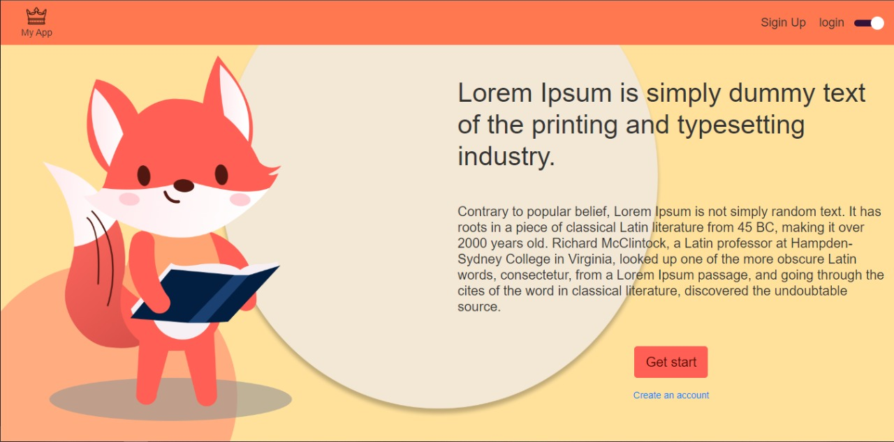
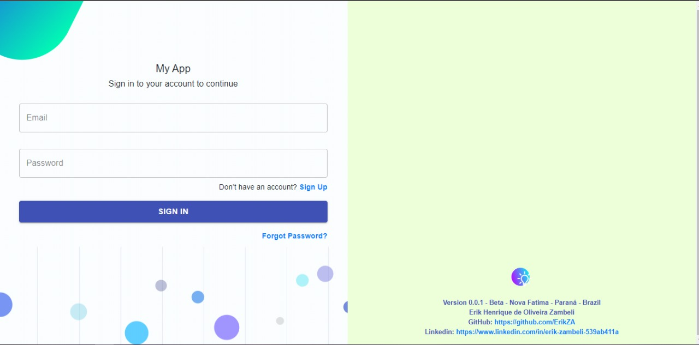
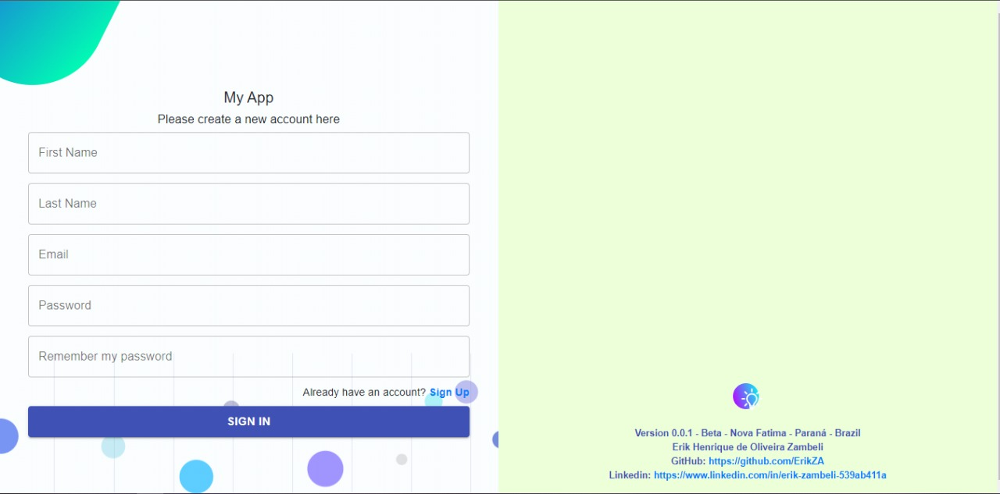
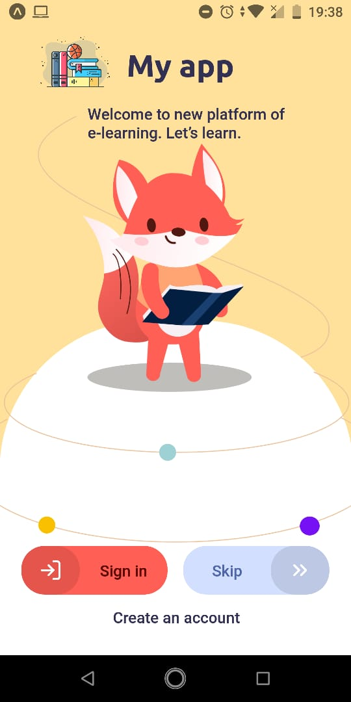
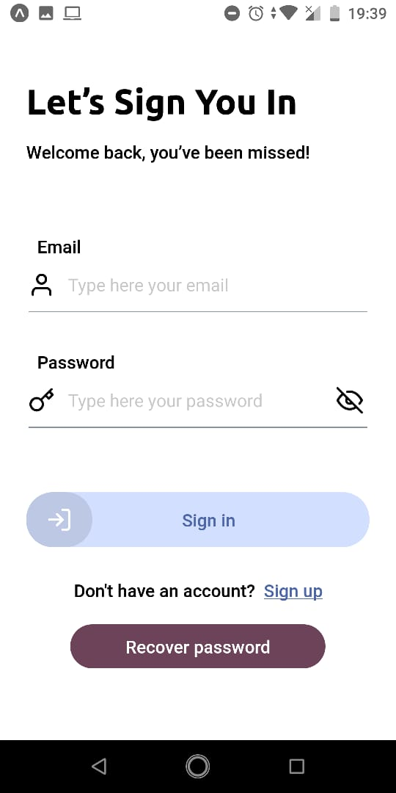
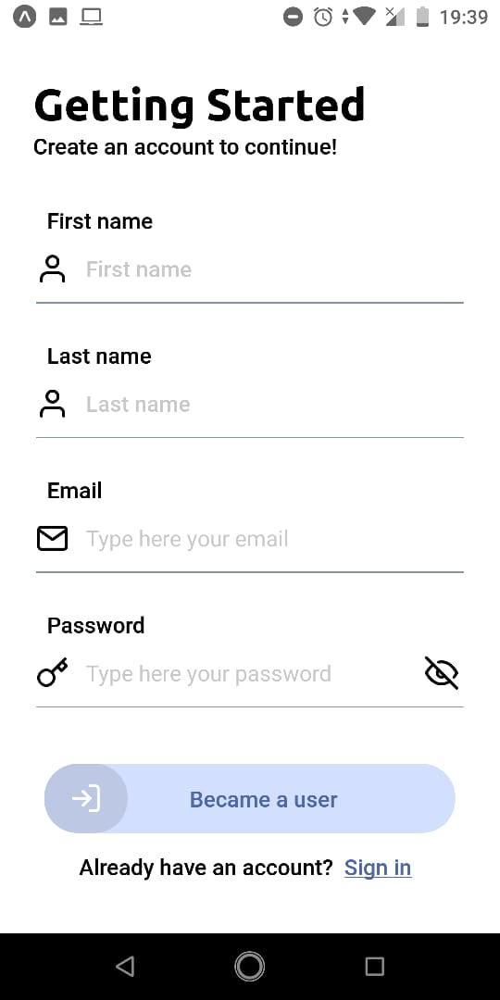
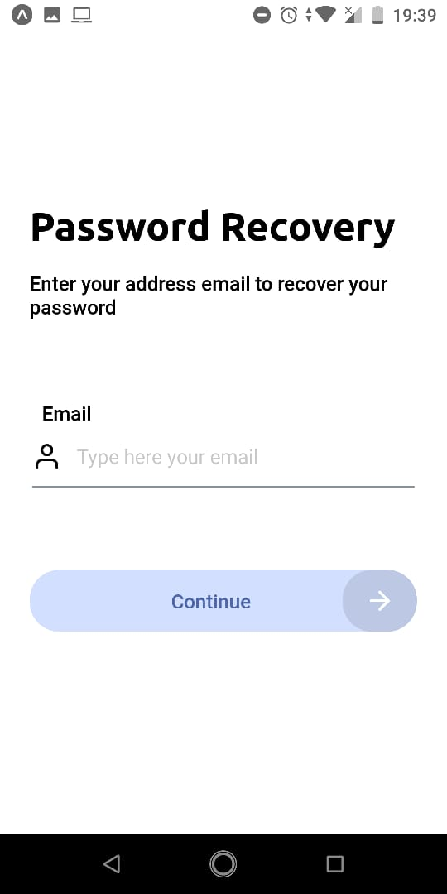

# My App
 
App desenvolvido para a testar o framework  Adonis 5 e a prática de autenticação em react e react native.
 
## My Site web

 

 
 
 

 

## My App 

 

 
 

## Tecnologias

Esse projeto foi desenvolvido com as seguintes tecnologias:

- [Node.js](https://nodejs.org/en/)
- [AdonisJs](https://preview.adonisjs.com/)
- [React](https://reactjs.org)
- [React Native](https://facebook.github.io/react-native/)
- [Expo](https://expo.io/)

## Licença

Esse projeto está sob a licença MIT. Veja o arquivo [LICENSE](LICENSE.md) para mais detalhes.

